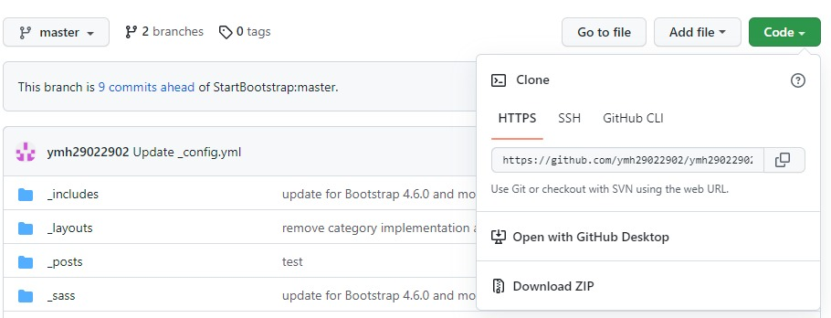
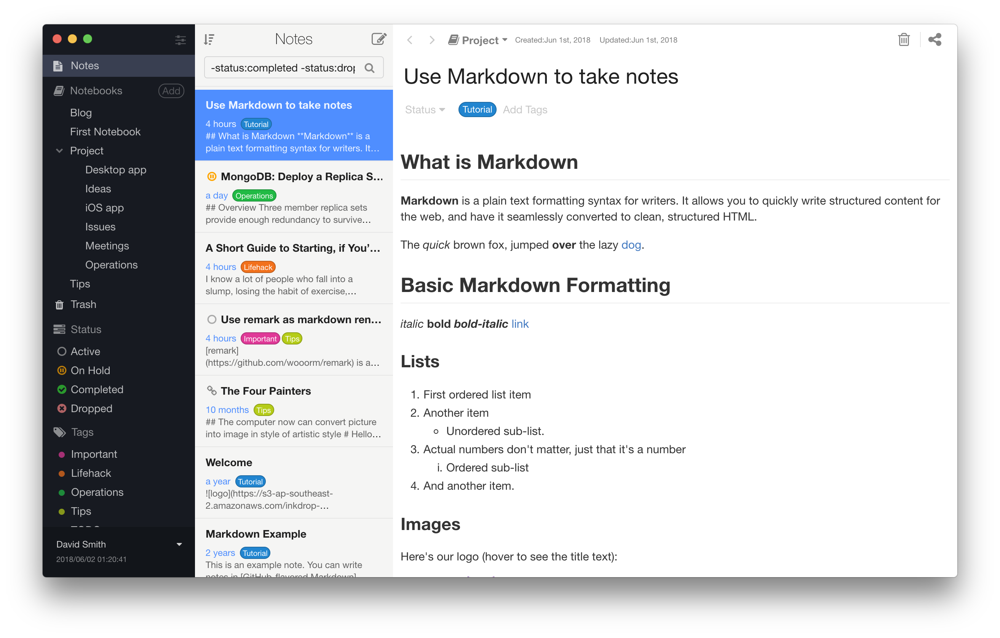

# GitHub

<hr/>

### github란?

</hr>
<br/>

* 개요
  * 분산 버전 컨트롤 소프트웨어 깃(Git)을 기반으로 소스 코드를 호스팅하고, 협업 지원 기능들을 지원하는 마이크로소프트의 웹 서비스
  * 2007년 샌프란시스코에 위치한 본사에서 톰 프레스틴 워너(Tom Preston-Werner), 크리스 완스트래스(Chris Wanstrath), 피 제이 하이엣(P.J.Hyett)을 중심으로 루비 온 레일스(Ruby on Rails)로 개발, 2008년 2월 웹 서비스로 개발됨. 이후 2018년 6월 4일 마이크로소프트에서 인수, 현재 자회사로 운영중
  * 매년 깃허브 생태계에 대해 옥토버스(Octoverse)라는 레포트를 공개    

<br/>

* 특징
  * Git 저장소를 관리하는 클라우드 기반 호스팅 시스템(VCS)
    >> 코드가 변경된 기록을 모두 로그화 자체 구축이 아닌 빌려쓰는 클라우드 개념
  * 오픈소스는 일정 부분 무료로 저장 가능하며, 아닐 경우 유료로 사용해야 한다.
  * Git으로 로컬 저장소에 작업한 내용을 저장한 뒤 해당 내용을 Github에 업로드하는 형식으로 사용

<br/><br/>

### 형상관리란?
* 소프트웨어 구성 관리(Software COnfiguration ManageMent) : 소프트웨어의 변경사항을 체계적으로 추적하고 통제하는 것
* 일반적인 단순 버전관리 기반의 소프트웨어 운용을 좀 더 포괄적인 학술 분야의 형태로 넓히는 근간
>> 변경관리 : 소스코드 변경 사항에 대한 관리  
>> 버전 관리 : 변경사항을 버전이란 개념을 통해 관리
<br/>

  #### 형상 관리의 구조
  
  * 형상 식별(Configuration Identification) : 형상 관리의 대상이 무엇인지 식별하는 것. 
  * 형상 제어(Configuration COntrol) : 형상 항목의 버전(version control)과 변경에 대한 판단을 내리는 것
  * 형상 감사(Configuration Audit) : 요구대로 형상 항목의 변경이 제대로 이뤄졌는지 살펴보는 것
  * 형상 상태 보고(Configuration Statue Accounting) : 변경된 형상 항목을 관계된 사람들에게 알리는 것  
<br/><br/>

### git과 github의 차이점
<br/>

<hr/>

### CVS(Concurrent Versions System) : 동시 버전 시스템
<hr/>

* 개발과정에서 사용하는 파일들의 변경 명세를 관리하기 위한 시스템 
* 동시 버전 관리 시스템(Concurrent Versioning System)으로도 알려져 있다.
* 소프트웨어 프로젝트를 진행할 때, 파일로 이뤄진 모든 작업과 변화를 추적하고, 여러 개발자가 거리문제에 구애받지 않고 협력하여 작업이 가능하다.

<br/>

* __구조__   
    &nbsp;&nbsp;&nbsp;&nbsp;Server(프로젝트의 현재 버전과 변화를 저장)   
    &nbsp;&nbsp;&nbsp;&nbsp;&nbsp;&nbsp;&nbsp;&nbsp;&nbsp;|    
    &nbsp;&nbsp;&nbsp;&nbsp;Client(서버에 접속하여 프로젝트의 완전한 복사본을 얻을 수 있다.)

* __장점__
    * 1990년 11월 출시된 이후 많은 유저가 사용해왔으며, 안정적인 시스템을 갖추었다.
* __단점__
    * CVS 저장소의 파일은 이름변경이 불가능하며, 수정을 원할 경우 제거한 후 다시 추가해야 한다.
    * Commit 중 오류가 발생할 경우 롤백이 불가능하다.
    * 충돌 방지를 위해 최종 버전의 코드만이 작업 및 수정을 허가받았다.

<br>
<hr/>

### SVN(아파치 서브버전)
<hr/>

* 2000년에 CVS가 지닌 단점을 보완하고자 등장

* 구조
    * CVS와 마찬가지로 버전 관리되는 모든 파일을 저장하는 하나의 서버와, 중앙 서버에서 파일들을 가져오는 클라이언트들이 존재

    >     
    > 서버&nbsp; &nbsp;  --체크아웃(파일 다운)--> &nbsp; &nbsp; 클라이언트   
    >&nbsp;&nbsp;&nbsp; &nbsp; &nbsp;&nbsp;<-- 커밋을 통해 서버에 저장--  

* 장점
    * CVS의 한계를 보완하고자 만든 시스템이기에 좀 더 세부적인 조작 지원과 효율적인 분기 버전 운영이 제공된다.
    * 컴퓨터끼리 연결해 통신하던 P2P(Peer-To-Peer)모델을 사용하지 않음으로써 보안성이 강화되었다.
    * 언제든지 원하는 시점으로 복구가 가능하다.    

* 단점
    * 늘어난 편의성에 비례해 속도 또한 느려졌다.    
    * 여전히 중앙서버에 문제가 생길 경우 문제를 해결(복구)하기 전까지 진행에 차질이 생김

<br/>
<hr/>

### Git
<hr/>

* 개요
    * 로컬에서 관리되는 오픈 소스 버전 관리 시스템
    * 소스코드 수정에 따른 버전을 관리해주는 시스템
    * 브랜치의 생성, 이전 브랜치 복구, 삭제, 병합이 가능
    
* 구조
    * 분산 버전 관리 시스템(Distribued Version Control System(=DVCS)) 채택
    >> 클라이언트가 파일의 가장 최근의 스냅샷을 가져오는 대신 저장소(Repository)를 통째로 로컬 저장소에 복사해와서 사용 

* 특징  
    * 로컬 저장소를 사용하므로 다른 개발자와 실시간으로 작업을 공유할 수 없음

<hr/>

### GitLab

<hr/>

* 개요
    * 소프트웨어 개발에서 출시 전 라이프사이클을 위한 통합된 하나의 도구
    * 프로젝트 계획에서 Git을 이용한 소스 코드 관리, CI/CD, 모니터링과 보안 기능 전부를 제공한다.

* 장점
    * 무제한의 개인 및 공용 Repository를 무료로 제공한다.
    * 단일 서버로 수천 명이 사용 가능하며, 팀을 분리하고 싶을 경우 GitLab Geo 인스턴스로 확장할 수 있다.

* 단점
    * GitHub에 비해 PUSH & PULL 기능이 느리다.
    * 페이지를 전환하는데 GitLab 인터페이스 시간이 소모됨 


<br/><br/>

|비교|Git|GitHub|
|---|---|---|
|관리 방식|로컬(사용자의 PC에 파일이 저장되는 개인 저장소)에서 관리|클라우드 방식으로 관리(저장소를 깃허브에서 제공)|
|다른 개발자와 프로젝트의 소스코드 공유가 가능한가?|공유가 불가능함|여러 개발자에 의한 버전 제어 및 공동작업 가능

<br/><br/>

|비교|Git|SVN|
|---|---|---|
|개발자 고유의 버전 관리가 가능한가?|개발자가 자신만의 version history를 가질 수 <span style="color:blue">있음</span>|개발자가 자신만의 version history를 가질 수 <span style="color:red">없음</span>|
|작업한 내용이 즉각적으로 반영되는가?|즉각 반영되지 않음|즉각 반영됨
|저장방식|분산형 관리 시스템|중앙 서버에 소스코드와 히스토리를 저장|
|속도가 빠른가?|사본을 로컬에서 관리하기에 빠름|인터넷을 경유해야 하기에 느림

<br/><br/>

|비교|GitHub|GitLab|
|---|---|---|
|사용 방식|둘 다 Git Repository를 중심으로 개발 업무를 진행||
|Repository|Git, SVN, HG(Mercurial), TFS(Team Foundation Serve) 지원|Git 지원|
|공개여부|공개(오픈소스)|비공개(개인 설정에 따라 공개 가능)|


<br/><br/>

<hr/>

### github의 사용법
<hr/>


1. 계정등록   


깃허브를 이용하기 위해선 먼저 GitHub에 가입이 필요하다. https://github.com/에 엑세스한다.

<br/>

   

<br/>

GitHub에서 사용할 사용자의 이름과 이메일 주소, 비밀번호를 입력하여 계정 등록을 한다. 이후 이메일 등록을 마치면 GitHub를 이용할 수 있는 계정이 생성되었다.   
이제 깃허브의 사용 과정을 알아보도록 하겠다. 사용 툴에 따라 약간의 차이는 존재하지만, 클론 -> 작성 -> 커밋 -> 푸쉬 과정은 동일하다.

<pre>
  1. Github에 저장소 작성 (git init) 또는 복제 (git clone)
  2. 파일의 작성, 편집
  3. 파일의 생성 / 변경 / 삭제를 git 인덱스에 추가 (git add)
  4. 변경 결과를 로컬 저장소에 커밋 (git commit)
  5. 로컬 저장소를 푸쉬해 원격 저장소에 반영 (git push)
</pre>

2. GitHub에 저장소 작성
   
* 계정을 생성하였으니 GitHub를 통한 프로젝트 생성이 가능해졌다. 우선 저장소를 만들기 위한 Create New Repository 버튼을 클릭해보도록 한다.

   
* 저장소의 이름과 공개 여부, README 파일을 생성할 것인지를 결정한 뒤 Create Repository 버튼을 누르면 저장소가 생성된다.

3. Git clone
  

* 저장소가 형성되었지만 실제 작업은 로컬 저장소(개발자의 컴퓨터)에서 이루어지므로 작업 공간을 만든 후 미러링을 해야 한다.
* 파일을 내려받을 경우 우선 git 주소를 clone하거나 zip 파일을 다운받게 된다.
* 여기선 우선 파일을 Push하는 것부터 설명하도록 하겠다.

<pre>
mkdir ~/ test
cd helloworld
git init
</pre>

우선 mkdir ~/ test로 test라는 디렉토리를 형성한다. mkdir는 make directory의 약자로, 깃 명령어가 아닌 일반적인 탐색 명령어이다.   
다음으로 cd test를 입력해 방금 형성한 디렉토리로 이동한 후 작업을 시작한다.
git init의 경우 Git 저장소를 새로 만드는 명령으로, 이 명령을 실행함으로서 현재 디렉토리를 Git 저장소로 변환한다.

4. 파일 편집 후 git index에 추가

* 이후 파일을 해당 폴더에 형성하거나 옮긴다(Hello.index를 생성했다고 가정).   
* 그 다음 git add Hello.html 명령어를 통해 commit 이전 임시 저장소인 index에 올린다.   
* 추가된 파일은 git statue 명령어를 통해 확인이 가능하다.
* 추가적으로 git주소를 복사, `git remote add origin `의 뒤에 기입해 원격 저장소의 정보를 추가한다.

5. 원격 저장소에 반영
* 이제 로컬 저장소의 변경 사항을 GitHub에있는 원격 저장소에 반영하기 위해 다음 명령을 실행한다.

<pre>git push origin master</pre>

GitHub의 사용자 이름과 암호를 입력하면, GitHub에 푸시하고 원격 저장소에 반영할 수 있다. 작업이 끝났으면 github.com페이지로 가서 파일이 잘 푸쉬가 됐는지 확인하도록 한다.

<br/>
<hr/>

### Fork, Pull Request
<hr/>


#### Fork 
* 상대방의 저장소를 나의 저장소로 그대로 복사, 찍어내는 것
* 수정된 파일은 원작자의 저장소가 아닌, 본인의 저장소에 저장됨
* 저장소에 업로드 되는 과정을 커밋(commit)이라고 하며, 커밋 과정시엔 커밋 메세지를 통해 변경사항을 기록하여야 한다.
<br/>

#### Pull Request  
* 본인의 저장소에 복사된 저장소로 입장, pull request 탭으로 들어가 new pull request를 선택한 후 본인의 파일을 pull  request 할 수 있다.
* 저장소의 원작자에게 자신이 제작한 파일을 '가져가서 적용'해줄 것을 요청
* commit과 마찬가지로 커밋 메세지를 통해 상세 내역 기록
<br/>

<hr/>

### Pull, Push, COmmit, Merge, Branch
<hr/>

* 풀(Pull) 
  * Github(또는 원격 저장소)에서 파일을 다운로드하는 작업
  * Fetch와 Merge를 동시에 행하는 것

<br/>

* 커밋(Comit) : Git(로컬 저장소)에 파일을 추가하거나 변경 내용을 저장하는 방법

<br/>

* 푸쉬(Push) : Github(또는 원격 저장소)에 파일을 추가하거나 변경 내용을 저장하는 작업

<br/>

* Fetch : 원격 저장소에서 로컬 저장소로 내려받는 것

<br/>

* Merge : 여러 개의 브랜치를 하나로 모으는 브랜치 통합 방식

<br/>

* 브랜치(Branch) 
  * 독립적으로 어떤 작업을 진행하기 위한 개념이자 독립된 working directory를 의미한다. 
  * 필요에 의해 만들어지는 각각의 브랜치는 다른 브랜치의 영향을 받지 않기 때문에 여러 작업을 동시에 진행이 가능함.
  * 생성한 브랜치를 다른 브랜치와 병합(Merge)함으로써 새로운 브랜치로 모을 수 있음.
  * 테스트 및 백업 등의 용도로도 사용이 가능.
  * 프로젝트 진행 시 각자 메인 저장소에 자신의 작업 전용 브랜치를 만든 후, 작업이 끝난 사람은 메인 브랜치에 자신의 브랜치의 변경 사항을 적용. 
  >> => 다른 사람의 작업에 영향없이 독립적으로 특정 작업을 수행하고 그 결과를 하나로 모아 나갈 수 있음 . 

  * **마스터 브랜치**
    * 저장소를 처음 생성되는 순간 Git이 생성하는 브랜치
    * 처음 생성되는 순간의 명칭은 master이다.
    * 다른 브랜치를 생성한 후, 해당 브랜치에서 작업을 수행하겠다고 선언하기 이전까진 마스터 브랜치에서 작업이 이루어진다.

  * 브랜치 사용법
    * 브랜치 사용을 위해선 Git 저장소가 준비되어야 한다.   
    위에서 설명했던 mkdir ~, cd ~, git init을 통해 저장할 폴더를 생성한 후 Git 저장소로 저장한다.

       
    경로를 지정한 후 branch할 파일을 생성하였다.
    
    현재 chapter1.md 파일엔 깃허브에 대한 설명이 적혀있으며, 여기에 추가적인 설명을 넣은 다음 branch를 통해 통합할 계획이다.

    
    우선 chapter1.md 파일을 커밋한다. 커밋한 파일은 마스터 브랜치에 올라가게 된다.

    
    pluschapter(가칭)이라는 새로운 브랜치를 git branch <브랜치명> 명령어를 통해 생성한다.    
    이후 git branch 명령어를 입력하면 브랜치 목록이 확인 가능하며, 앞에 *이 붙어있는 것이 현재 선택된 브랜치이다.

    
    새로 생성한 브랜치에서 작업을 수행하기 위해 <pre>git checkout <브랜치명></pre> 명령어를 입력한다.

    
    이제 'pluschapter' 브랜치를 체크아웃한 상태에서 커밋을 수행하면 본 브랜치에 그 이력이 기록된다. chapter1.md에 문장을 추가한 후 커밋을 한다.
    
    현재 마스터 브랜치에는 내용을 추가하기 전의 파일이 커밋되어 있으며, pluschapter 브랜치에는 내용이 추가된 파일이 커밋되어있다.   이를 확인하는 방법은 사용중인 브랜치를 마스터로 전환한 후 파일을 열어보면 확인이 가능하다.
    
    내용을 추가하기 전 버전의 파일임을 확인할 수 있다. 이제 브랜치 병합을 하도록 하겠다. 
    
    git merge <통합시킬 브랜치명> 명령어를 통해 마스터 브랜치가 가리키는 커밋이 plusbranch와 같은 위치로 이동하였다. 이러한 방식의 병합을 fast-forward(빨리감기) 병합이라고 한다.

    pluschapter 브랜치의 내용은 성공적으로 master에 통합되었기에 이제 해당 브랜치의 용도가 사라졌다.   
    브랜치를 삭제하려먼 git branch -d <브랜치명> 명령어를 입력하면 된다.

    
    성공적으로 삭제가 이루어졌음을 브랜치 목록 확인을 통해 알 수 있다.
<br/>
<hr/>

### Issue, Project, Tag, Release

<hr/>

### Issue 
* 프로젝트 기획, 새롭게 추가될 기능, 버그와 수정사항 등 모든 것
* 모든 활동 내역에 대해서 이슈를 등록하고 등록한 이슈를 기반으로 작업을 진행할 수 있기에 프로젝트의 작업, 개선 사항 및 버그를 추적하는 좋은 방법으로 사용됨.
<br/>

* 개발자간 idead, work, bug(problem)을 다루기 위해 깃허브는 이슈를 사용함.
  * 아이더 구현에 관한 논의
  * 작업 진행사항 추적
  * 기능 제안 수락, 질문, 요청 지원 또는 버그 보고
  * 정교한 코드 구현
<br/>

* 이슈를 등록하기 위한 단계
  * 이슈 탭 오픈
  * 해당 문제, 상황을 재현할 수 있는 최대한 많은 정보(context)를 제공
  * 해당 환경 정보(버전, os 등) 관련이 있다고 생각하는 모든 정보를 제공
<br/>

* 이슈 등록 후의 단계
  * 프로젝트 팀(혹은 매니저)이 라벨(label)과 담당자(assingn)을 지정
  * 담당자의 신속한 응답 환경 구축을 위한 노력
  * 해결이 되거나 오랜 기간 답변이 없을 경우, 이슈는 닫힘(closed).

### project

* 작업이 발생했을 떄 아주 간단하거나 작은 것이 아닐 경우 프로젝트라고 정의

### Tag

* 커밋을 참고하기 쉽도록 알아보기 쉬운 이름을 붙이는 것
* 한번 붙인 태그는 브랜치처럼 위치가 이동하지 않고 고정됨
* Git 에서는 일반 태그와 주석 태그를 사용할 수 있음
  * 일반 태그(Lightweight tag)
    * 이름 정보만을 가짐
  * 주석 태그(Annotated tag)
    * 이름뿐 아니라 태그에 대한 설명, 서명, 제작자명, 날짜 정보등을 포함 가능
#### Release

* 소프트웨어의 소스코드 뿐만 아니라 소프트 웨어를 빌드한 결과물을 배포할 수 있는 기능

</img>
> 깃허브의 우측에 위치해있다.

</img>
> Create a new release를 통해 새로운 릴리즈를 작성할 수 있으며, master 브랜치에 달려있는 태그와 함께 릴리즈 제목, 릴리즈 노트 그리고 소스코드를 빌드한 바이너리를 첨부할 수 있다. 

<br>

# 마크다운
<br/>

## 마크다운이란?
* 텍스트 기반의 마크업 언어
* 존 그루버(John Gruber)와 아론 스워츠(Aaron Swartz)에 의해 2004년 탄생하였다.
* 특수기호와 문자를 잉용한 매우 간단한 구조의 문법을 사용하여 웹에서도 보다 빠르게 컨텐츠를 작성하고 직관적으로 인식이 가능하다.
* 깃허브를 접해본 이들에겐 README.md가 익숙할 것이다.
<br/><br/>

<hr/>

## 마크다운의 장점·단점
<hr/>

### 장점
<pre>
1. 간결하고 별도의 도구 없이 작성이 가능하다.
2. HTML을 비롯하여 다양한 형태로 변환이 가능하다.
3. 텍스트(Text)로 저장되기 때문에 용량이 적다는 이점을 지니며, 이로 인해 보관이 용이하다.
4. 텍스트파일이기 때문에 버전관리시스템을 통해 변경이력의 관리가 가능하다.
5. 지원하는 프로그램과 플랫폼이 다양하다.
</pre>
### 단점
<pre>
1. 표준이 없으며, 이로 인해 도구에 따라 변환방식이나 생성물이 다르다.
2. 모든 HTML 마크업을 대신하지 못한다.
</pre>
<br/>

<hr/>

## 마크다운 사용법
<hr/>

### 마크다운 에디터
<hr/>

### Typora


    
* 주소 : https://typora.io/
* 장점
    * 프리뷰 화면에서 수정이 가능하다(편집물과 출력물이 동일하게 나오는위즈윅(WYSIWYG) 방식).
    * 다양하고 깔끔한 테마와 레이아웃 / 테마 CSS 직접 수정이 가능하다.
    * 멀티 플랫폼을 지원한다.
    * LaTex/ 테이블 / UML Diagram 지원
    * 포커스 모드/ 타자기 모드
* 단점 
    * 15일간의 체험 기간이 지나면 유료 구매가 필요하다.
    * 스마트폰 미지원.
    * 다른 플랫폼과 연동시 외부 저장소가 필요하다.
<br/>    

### Inkdrop



* 주소 : https://www.inkdrop.app/
* 장점
    * 다양한 플랫폼을 지원한다.
    * 노트북 형식으로 폴더를 지원한다.
    * 태그 + 4가지 상태 (Active, On Hold, Completed, Dropped)로 분류가 가능하다.
    * 자체 패키지 매니저(ipm)이 있어서 오픈소스 플러그인으로 확장 기능 설치 가능
* 단점
    * 비교적 속도가 느린 편이다.
    * 디자인이나 UI가 타 편집기에 비해 떨어지는 편이다.
<br/>

### Visual Studio Code


* 주소 : https://code.visualstudio.com/
* 장점
    * 다양한 개발 언어와 code completion 기능을 지원한다
    * 기본적으로 제공하는 GIT 연동 기능을 통해 바로 GitHub에 글을 동기화할 수 있다.
    * VS code 상에서 terminal이 실행 가능하다.(단축키: ctrl+`)
* 단점
    * 비교적 최신 에디터이기에 마크다운 관련 기능이 부족하다.
    * 업데이트 후 간혹 한글 입력이 누락되는 버그 현상이 발생한다.
<br/>


### Bear


* 주소 : https://bear.app/
* 장점
    * 다양한 테마와 깔끔한 레이아웃을 지원함
    * 문서 간 링크 기능을 지원함
    * 태그 및 아카이브 기능을 지원함
    * 다양한 배포 옵션이 있으며 앱과 자유로운 연동(동기화)이 가능하다.
* 단점
    * 애플 계열 플랫폼만 지원한다.
    * 폴더 미지원으로 많은 문서를 분류하기가 어렵다.
<br/>

### Byword 2


* 주소 : https://bywordapp.com/
* 장점
    * 간결한 디자인 덕분에 방해받지 않고 집중할 수 있다.
    * Light, Dark로 구성된 깔끔한 테마 2종.
    * Meduim, WordPress, tumblr, Blogger, Evernote 등 다앙한 배포가 가능하다.
    * iCloud Drive를 지원한다,
* 단점
    * 프리뷰 화면으로 전환이 불편하다
    * macOS와 iOS에 대해 따로 구입이 필요하다.
    
<br/>

      
<hr/>

## 문법(Syntex)

<hr/>

### 헤더(Headers) 
* 큰 제목 : 문서 제목<pre>
This is an H1
=============
</pre> 

# This is an H1
* 작은 제목 : 문서 부제목<pre>
This is an H2
-------------
</pre>

## This is an H2

* 글머리 : 1~6까지 지원한다.
*  HR(Horizontal Rule, 수평선 구분자)과 결합해 사용이 가능하다.
<pre>
# This is a H1
## This is a H2
### This is a H3
#### This is a H4
###### This is a H5
####### This is a H6

### This be added to hr
</pre>

# This is a H1

## This is a H2

### This is a H3

#### This is a H4

##### This is a H5

###### This is a H6

### This be added to hr
___
<br/>

### 본문(paragraph)
* HTML의 <p>와 같은 본문은 텍스트를 그대로 작성하면 된다.
<pre>This is a paragraph</pre>
This is a paragraph

<br>

### BlockQuote
* 이메일에서 사용하는 > 블럭인용문자를 이용한다.
<pre>
> This is a first blockquote.
>> This is a second blockquote.
>>> This is a third blockquote.
>>>   > This is a last blckquote.
</pre>

> This is a first blockquote.
>> This is a second blockquote.
>>> This is a third blockquote.
>>>   > This is a last blockquote

BlockQuote 안에서는 다른 마크다운 요소를 포함할 수 있다
> ### This is a H3
>> * Ul
>>> + ol
>>>    > ~~content~~


### 목록
* 순서있는 목록(번호)
    * 순서있는 목록은 숫자와 점을 사용한다.
    <pre>
    1. 첫번째
    2. 두번째
    3. 세번째</pre>

    1. 첫번째
    2. 두번째
    3. 세번째

    * 순서를 바꿔서 적어도 출력물은 항상 내림차순으로 정의된다.
    <pre>
    1. 첫번째
    3. 세번째
    2. 두번째</pre>

    1. 첫번째
    3. 세번째
    2. 두번째

* 순서없는 목록 (글머리 기호: *, +, - 지원)
<pre>
* 빨강
    * 주황
        * 노랑

+ 빨강
    + 주황
        + 노랑      

- 빨강
    - 주황
        - 노랑</pre>

* 빨강
    * 주황
        * 노랑

+ 빨강
    + 주황
        + 노랑      

- 빨강
    - 주황
        - 노랑

기호를 혼합해서 사용해도 출력은 정상적으로 작동한다.
<pre>
* one
    - two
        * three
            + four</pre>

* one
    - two
        * three
            + four            

### 코드
4개의 공백, 또는 하나의 탭으로 들여쓰기를 만나면 변환되기 시작하여 들여쓰지 않은 행을 만날때까지 변환이 계속된다.

* 들여쓰기
<pre>
This is a normal paragraph:

    This is a code block.
    
end code block
</pre>    

This is a normal paragraph:

    This is a code block.

end code block    

한 줄을 띄어쓰지 않으면 들여쓰기가 제대로 작동하지 않는다.

<pre>
This is a normal paragraph:
    This is a code block.    
end code block
</pre>

This is a normal paragraph:
    This is a code block.   
end code block 

<br>

* 코드블럭

    * 코드블럭 이용엔 다음과 같은 2가지 방식이 존재한다.

    `<pre><code>{code}</code></pre>` 이용방식

        * 마크다운은 코드블럭을 `<pre>`와 `code`로 감싼다.
        
    ```
    <pre>
    <code>
    public class StartStudyByMarkdown{
        public static void main(String[] args){
            System.out.PrintIn("MarkDown");
        }
    }
    </code>
    </pre>
    ```
    
    <pre>
    <code>
    public class StartStudyByMarkdown{
        public static void main(String[] args){
            System.out.PrintIn("MarkDown");
        }
    }
    </code>
    </pre>

    * 코드블럭코드("```")를 이용하는 방법

    <pre>
    ```
    public class StartStudyByMarkdown{
        public static void main(String[] args){
            System.out.PrintIn("MarkDown");
        }
    }
    ```
    </pre>

    ```
    public class StartStudyByMarkdown{
        public static void main(String[] args){
            System.out.PrintIn("MarkDown");
        }
    }
    ```
<br/>
   
* 깃헙에서는 코드블럭코드("```") 사적점에 사용하는 언어를 선언하여 문법강조(Syntax highlighting)가 가능하다.

    <pre>
    ```java
    public class StartStudyByMarkdown{
        public static void main(String[] args){
            System.out.PrintIn("MarkDown");
        }
    }
    ```
    </pre>

    ```java
    public class StartStudyByMarkdown{
        public static void main(String[] args){
            System.out.PrintIn("MarkDown");
        }
    }
    ```

### 수평선`<hr/>`<hr/> 
* 마크다운 문서를 미리보기로 출력할 때 페이지 나누기 용도가 주된 용도이다.
* 아래 줄은 모두 수평선을 생성한다.   
<pre>
* * *
***
*****
- - -
-------------------------
</pre>
=>
* * *
***
*****
- - -
-------------------------

### 링크
* 참조링크
<pre>
[link keyword][id]

[id]: URL "Optonal Title here"

// code
Link: [Google][googlelink]

[googlelink]: https://www.google.co.kr "Go google"
</pre>

Link: [Google][googlelink]

[googlelink]: https://www.google.co.kr "Go google"

* 외부링크
<pre>
사용문법 : [Title](link)
적용예 : [Google](https://google.co.kr, "google link")
</pre>

[Google](https://google.co.kr, "google link")

* 자동연결
<pre>
일반적인 URL 혹은 이메일주소인 경우 적절한 형식으로 링크를 형성한다.

* 외부링크 : http://example.com/
* 이메일링크 : address@example.com
</pre>

* 자동연결
<pre>
일반적인 URL 혹은 이메일주소인 경우 적절한 형식으로 링크를 형성한다

* 외부링크 : http://example.com/
* 이메일링크 : address@example.com
</pre>
* 외부링크 : http://example.com/
* 이메일링크 : address@example.com

<br>

### 강조

<pre>
*emhpasize*
_emphasize_
**emphasize**
__emphasize__
~~emphasize~~
</pre>
*emhpasize*   
_emphasize_   
**emphasize**   
__emphasize__   
~~emphasize~~

<br/>

* 문장 중간에 사용할 경우에는 ~~띄어쓰기~~ 를 사용하는 것이 좋다. 

<br/>
<hr/>

### 이미지
<hr/>

<pre>


</pre>


이미지의 크기 조절 기능은 없기에 html과 유사하게 `</img>`를 이용한다,

```
</img>
</img>
```

</img>
</img>

<br/>
<hr/>

### 줄바꿈
<hr/>

* 3칸 이상 띄어쓰기(   )를 하면 줄이 바뀐다.

<pre>
    * 줄 바꿈의 조건은 문장 마지막에서 3칸 이상을 띄어써야 한다.   그래야만 줄바꿈이 된다.
     * 줄 바꿈의 조건은 문장 마지막에서 3칸 이상을 띄어써야 한다.___\\ 그래야만 줄바꿈이 된다.
</pre>

* 줄 바꿈의 조건은 문장 마지막에서 3칸 이상을 띄어써야 한다.   
그래야만 줄바꿈이 된다.

<br/>
<hr/>

### 표(table)
<hr/>
<br/>

* 마크다운에서 표를 만드는 방식은 마크다운 문법과 HTML 방식이 존재한다.

<br/>

### 일반적인 표

<br/>

* 문자와 -를 사용해 표를 구현할 수 있다.

<pre>
|이름|성별|나이|
|---|---|---|
|영희|female|28|
|철수|male|33|
</pre>
|이름|성별|나이|
|---|---|---|
|영희|female|28|
|철수|male|33|

<br/>

### 정렬

<br/>

* :문자를 통해 정렬을 정의할 수 있다.
<pre>
|방향|방향|방향|
|:---|:---:|---:|
|왼쪽|중앙|오른쪽|
|왼쪽|중앙|오른쪽|
</pre>
|왼쪽으로 정렬|중앙으로 정렬|오른쪽으로 정렬|
|:---|:---:|---:|
|왼쪽|중앙|오른쪽|
|왼쪽|중앙|오른쪽|

<br/>

#### 셀 확장

<br/>

* 사이가 비어있으면 자동으로 확장됨
<pre>
|자동 확장|자동 확장|자동 확장|
|:---|:---:|---:|
|왼쪽|||
||중앙||
|||오른쪽|
</pre>
|자동 확장|자동 확장|자동 확장|
|:---|:---:|---:|
|왼쪽|||
||중앙||
|||오른쪽|

<br/>

#### 셀 강조

<br/>

* 위에 나온 일반 Text와 마찬가지로 테이블도 *와 **를 통해 이탤릭/강조를 표시할 수 있다.
<pre>
|제목|내용|설명|
|---|---|---|
|테스트1|*강조1*|이탤릭|
|테스트2|**강조2**|강조|
|테스트3|~~강조3~~|취소선|
</pre>

|제목|내용|설명|
|---|---|---|
|테스트1|*강조1*|이탤릭|
|테스트2|**강조2**|강조|
|테스트3|~~강조3~~|취소선|

<br/>

#### html 방식

<br/>

* html에서 사용했던 <th>,<tr>,<td>를 사용한 표 구현 또한 가능하다.

```
<table>
<tr>
    <th>제목</th>
    <th>내용</th>
    <th>설명</th>
</tr>
<tr>
    <td>제목1</td>
    <td>내용1</td>
    <td>설명1</td>
</tr>
<tr>
    <td>제목2</td>
    <td>내용2</td>
    <td>설명2</td>
</tr>
</table>
```

<table>
<tr>
    <th>제목</th>
    <th>내용</th>
    <th>설명</th>
</tr>
<tr>
    <td>제목1</td>
    <td>내용1</td>
    <td>설명1</td>
</tr>
<tr>
    <td>제목2</td>
    <td>내용2</td>
    <td>설명2</td>
</tr>
</table>

<br/>

### CSS

<br/>

* 마크다운 문법에서는 글자 색을 지정하는 문법이 존재하지 않음
* HTML의 span 태그를 통해 CSS 구현

```
* <span style="color:red; font-weight:bolder">Red </span>button
```

* <span style="color:red; font-weight:bolder">Red </span>button
